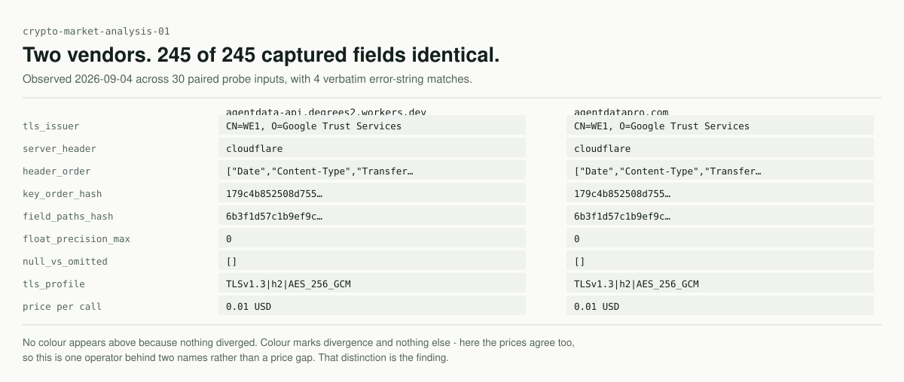
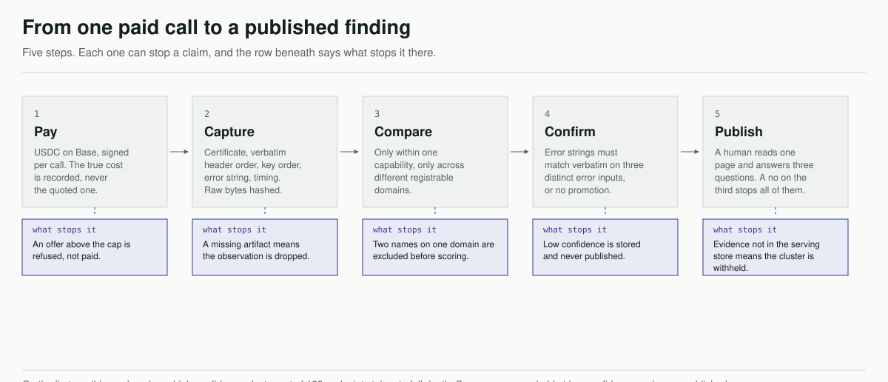
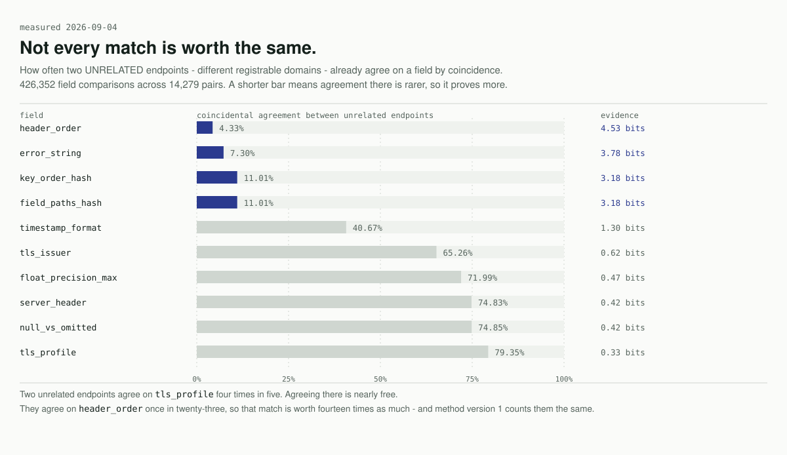

<div align="center">

# Crosspeel

**Measures whether independently branded machine-payable APIs are actually independent.**

[crosspeel.com](https://crosspeel.com) &nbsp;·&nbsp; [Method](https://crosspeel.com/method/) &nbsp;·&nbsp; [Every endpoint observed](https://crosspeel.com/endpoints/) &nbsp;·&nbsp; [Disputes](https://crosspeel.com/disputes/)

</div>

<br>



<br>

## What this is, if none of those words meant anything

Software can now buy things from other software. A program hits a web address, gets
told "that costs 0.01 USD", pays in stablecoin, and gets its answer - no signup, no
API key, no human. Thousands of these paid endpoints exist. That payment standard
is called **x402**.

A developer wiring up an agent picks four of them, from four different-looking
companies, and believes they have four suppliers.

Often they have one supplier and four price tags.

Crosspeel finds out which, by paying each endpoint and reading what comes back
very carefully.

<details>
<summary><b>The words, in one line each</b></summary>

<br>

| Word | What it means here |
|---|---|
| **endpoint** | One web address you can send a request to and get data back |
| **x402** | The standard that lets software pay for a request. Named after HTTP status code 402, "payment required" |
| **USDC** | A digital dollar. One USDC is one US dollar |
| **Base** | The network the payments settle on. Cheap and fast |
| **observation** | One paid call, with everything Crosspeel recorded about the response |
| **fingerprint** | The small details of a response that its operator never thought to choose |
| **cluster** | A group of endpoints whose responses agree far more than coincidence allows |
| **MCP** | Model Context Protocol. How an AI agent plugs in a tool |

</details>

## Why the details give it away

Nobody writes an API thinking about the order their server lists its response
headers, or the exact wording of an error nobody is meant to see.

So those are the things two endpoints cannot help but share when the same machine
is answering both. Crosspeel pays each endpoint, records eleven of these details,
and compares them - only against endpoints doing the same kind of job, and only
across genuinely different owners.

> **The whole product is one claim: measurement beats assertion.**
> Crosspeel asserts no relationship between operators. It says *these fields
> matched and this one costs more*, and it publishes the stored response so anyone
> can check.

<br>



## Not every match counts the same

This is the part that is easy to get wrong, so it was measured rather than assumed.

Two endpoints run by completely unrelated people already agree on some details by
sheer coincidence - four in five share the same TLS setup, because most of the web
runs on the same handful of providers. Agreeing there proves almost nothing.
Agreeing on header order is twenty times rarer.

<br>



<br>

**This is a finding about Crosspeel's own method, published alongside the findings
it produces.** Method version 1 weights all ten fields equally, and the chart shows
it should not. That is written up in full in the engine's decisions log and it is
what method version 2 changes.

## Use it from an AI agent

One entry in your MCP configuration. No package, no key, no account - the agent
pays per call at the transport layer.

```json
{
  "mcpServers": {
    "crosspeel": {
      "url": "https://crosspeel.com/mcp"
    }
  }
}
```

<details>
<summary><b>The three tools, and what they answer</b></summary>

<br>

| Tool | Ask it | It returns |
|---|---|---|
| `check_stack` | "Are these five endpoints actually different?" | Which ones group together, the prices, the cheapest in each group |
| `get_cluster` | "Has this endpoint been grouped with others?" | Its group, the price range, and a link to the evidence page |
| `cheapest_equivalent` | "Is there a cheaper way to get this same thing?" | The cheapest observed member of its group, with the date - or nothing, rather than a guess |

Every response carries two fields that exist to stop an agent drawing a
conclusion the data does not support:

- **`coverage`** - how many of the endpoints you asked about have actually been
  observed. An absence of duplication and an absence of data look identical
  without it.
- **`limits`** - what the method cannot see, in the payload, every time.

And a rule enforced in code, not by convention: **a low-confidence match is never
returned as a match.** It comes back unmatched, with the reason.

</details>

> [!NOTE]
> The MCP endpoint is not serving yet. The server is built and tested; the Worker
> that fronts it has not been deployed. Current state is always on
> [crosspeel.com](https://crosspeel.com).

## What this cannot see

Stated here rather than buried, because a method that hides its limits is asking
to be trusted instead of checked.

- Two operators independently buying from the same upstream supplier will look
  identical. That is a shared dependency, and Crosspeel cannot distinguish it from
  any other reason two responses agree.
- Two operators running the same open-source template will look identical.
- An operator who deliberately scrambles their key order and error wording will
  not group, and Crosspeel will not notice they are avoiding it.
- Nothing here observes ownership, contracts, or intent. The findings are about
  responses, not about companies.

## The first run, in numbers

Every figure below came from a command, and the command is in the run report.

| | |
|---|---|
| Resource URLs read from five public directories | 39,717 across 2,644 hostnames |
| Endpoints called at least once | 1,265 |
| Returning a valid, payable challenge | 90.28 percent |
| Payments completing successfully | 96.00 percent |
| Endpoints taken to full depth, 30 probe inputs each | 180 |
| Paid calls settled on Base | 2,388, for 25.01 USD |
| High-confidence clusters | **1** |
| Clusters held at low confidence and never published | 7 |

**The expectation going in was that more than 35 percent of endpoints would turn
out to be duplicates. The measured figure was 1.11 percent.** The prior was
recorded before the data arrived precisely so that it could be contradicted, and
it was.

<details>
<summary><b>Why that number is smaller than it looks</b></summary>

<br>

Two things narrow it, and both are stated rather than netted out:

1. Only 180 of 1,265 endpoints received the depth the method needs for high
   confidence. The rate is computed over those 180, not over the whole market.
2. Endpoints advertising no description at all were excluded - 43.37 percent of
   them. That is where cheaply assembled endpoints most plausibly sit, so the
   population most likely to contain duplicates is the one this run did not test.

</details>

## What is in this repository

This is the public half. The method is open so the findings can be checked; the
corpus and the probe engine are private, because eleven weeks of stored
observations cannot be recreated by reading code.

```
src/pages/          the site - every page on crosspeel.com
src/components/     the diff pane and the rest of the visual system
src/worker/         the evidence route, which serves stored responses back
src/data/           the published corpus the site is built from
mcp/                the MCP client, the tool schemas, and the response format
docs/assets/        the diagrams above, drawn from the design tokens
```

Anyone can read how the grouping works. Nobody else has the observations.

## Disputes

If you operate an endpoint named here and believe a finding is wrong, write to
**disputes@crosspeel.com** with the URL and what you believe is inaccurate.

Disputes are published on the finding's own page alongside it, whatever the
outcome - including the ones Crosspeel loses. That page being non-empty is worth
more than any amount of copy about rigour.

<br>

---

<div align="center">

Built and operated by [Tom Hogan](https://tomhogan.io).
Licensed under [Apache 2.0](LICENSE).

No endpoint can pay to be listed, delisted, ranked, or unranked.<br>
There is no mechanism to do so and there will not be one.

</div>
